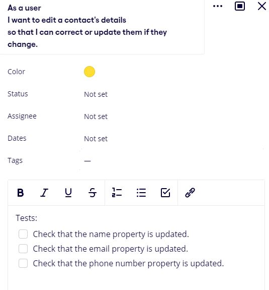

# Client Brief

## Value Proposition

This Address Books application provides a digital solution to the storage of individual's unique details such as name,
email and phone number. Future-proof your list of contact details as your storage won't run out unlike a physical book
with limited pages and enjoy the standardised formatting that comes with a digital system. The search function allows
quick access to any of your contacts, with the ability to edit or remove existing contacts and to add new ones.

### User Benefits

A traditional physical address book has limited space, whereas DFCorp's latest offering will scale indefinitely as your
list of contacts grows over time. You're able to quickly find the individual's details by entering a name into the
search function. The system is robust enough to accommodate unusually short or long names and email addresses, whilst
also ensuring there is uniform formatting and requirements for all properties for each contact created.

### Business Impacts

Having a digital address book for your business will help increase overall productivity and reliability that can extend
to a better experience for your customers. Imagine having your customer's details available at the press of a button
when they unexpectedly call or arrive at your store instead of having to rifle through a book or stack of papers. By
having rapid access to their details, you've made a positive impression on the customer and can quickly focus onto
assisting them, thus providing better service and helping retain them as a future customer.

This test driven application offers a significantly higher level of security and data protection for you and your
client's personal details. With the system's validation functions throughout the application, all new and edited
contacts will conform to a standard format even if there are many staff users with varying preferences of detail
formatting.

---

## User Stories

\
\
\
\
\

