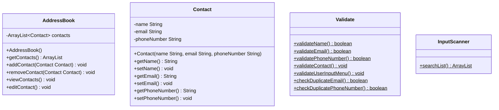

# Domain Models, Class Diagrams and Test Plan

```mermaid
classDiagram
    class AddressBook {
        -ArrayList~Contact~ contacts
        +AddressBook()
        +getContacts() ArrayList<Contact>
        +addContact(Contact Contact) void
        +removeContact(Contact Contact) void
        +viewContacts() void
        +editContact() void
    }
    class Contact {
        -name String
        -email String
        -phoneNumber String
        +Contact(name String, email String, phoneNumber String)
        +getName() String
        +setName() void
        +getEmail() String
        +setEmail() void
        +getPhoneNumber() String
        +setPhoneNumber() void
    }
    class Validate {
        +validateName()$ boolean
        +validateEmail()$ boolean
        +validatePhoneNumber()$ boolean
        +validateContact()$ void
        +validateUserInputMenu()$ void
        +checkDuplicateEmail()$ boolean
        +checkDuplicatePhoneNumber()$ boolean
    }
    class InputScanner {
        +searchList()$ ArrayList<Contact>
        
    }
```